# The Middle Way - Metadata

Central repository for shared metadata, documentation, and multi-platform coordination for The Middle Way project.

## 🌐 Platforms

| Platform | Status | Stack | Repository |
|----------|--------|-------|------------|
| 🌐 **Web** | ✅ v0.2.0-dev | Next.js 16, Tailwind v4 | [TheMiddleWay-Web](https://github.com/oatrice/TheMiddleWay-Web) |
| 📱 **Android** | ✅ v0.2.0-dev | Jetpack Compose, Material 3 | [TheMiddleWay-Android](https://github.com/oatrice/TheMiddleWay-Android) |
| 🍎 **iOS** | ✅ v0.2.0-dev | SwiftUI, iOS 17+ | [TheMiddleWay-IOS](https://github.com/oatrice/TheMiddleWay-IOS) |
| ⚙️ **Backend** | 🚧 In Progress | Go | [TheMiddleWay-Backend](https://github.com/oatrice/TheMiddleWay-Backend) |

## 🎨 Design System

**Bright Sky (Light)** - A clean, vibrant blue palette focusing on clarity and calmness:

| Token | Color | Hex | Usage |
|-------|-------|-----|-------|
| Sky White | 


 | `#EFF6FF` | Background |
| Bright Blue | 


 | `#2563EB` | Primary / Accent |
| Deep Blue | 


 | `#1E3A5F` | Text Primary |
| Sky Surface | 


 | `#DBEAFE` | Surface/Cards |

> **Note:** Also supports **Deep Cosmos (Dark Mode)**. See details in [THEME_OVERVIEW.md](./THEME_OVERVIEW.md).

**Typography:**
| Platform | Headings | Body |
|----------|----------|------|
| Web | Playfair Display | Inter |
| Android | System Default | System Default |
| iOS | System Serif | System Sans |

## 📁 Repository Structure

```
├── Platforms/
│   ├── Web/             # Next.js 16 + Tailwind v4
│   ├── Android/         # Jetpack Compose + Material 3
│   ├── iOS/             # SwiftUI + iOS 17
│   └── Backend/         # Go (Master Data Authority)
├── docs/                # Shared documentation
│   └── features/        # Feature specifications
├── README.md            # This file
├── ROADMAP.md           # Project roadmap
└── CHANGELOG.md         # Changelog
```

## 🏗️ Architecture (API-Centric Strategy)

We use an **API-Centric Approach** where all clients route their data requests through the Go backend, ensuring a single source of truth and centralized business logic.

```mermaid
flowchart TB
 subgraph Clients["Clients"]
        Web["🌐 Web App (Vercel)"]
        iOS["🍎 iOS App"]
        Android["📱 Android App"]
  end
 subgraph Firebase_Ecosystem["Firebase Ecosystem"]
        Auth["🔐 Firebase Auth"]
  end
 subgraph Backend_Services["Backend Services"]
        Go["⚙️ Go Backend (Render)"]
        Neon[("🐘 Neon Postgres")]
  end
    Web --> Auth
    iOS --> Auth
    Android --> Auth
    
    Web -- REST API --> Go
    iOS -- REST API --> Go
    Android -- REST API --> Go
    Go -- Primary Storage --> Neon

    style Go fill:#00add8,stroke:#333
    style Neon fill:#00e599,stroke:#333
    style Auth fill:#ffca28,stroke:#333
```



1.  **Clients (Web/Mobile):** Authenticate via Firebase Auth, then communicate exclusively with the Go Backend via REST APIs.
2.  **Go Backend (Render):** Acts as the central brain. It handles business logic, data fetching, and prevents direct database exposure to clients. Deployed on Render for cost-effective 24/7 availability during the MVP phase.
3.  **Neon DB:** The primary SQL storage for master data, user progress, and complex relationships.

## 🚀 Quick Start

### 🌐 Web
Deploying to **Vercel**.
- **Live Demo:** *(Waiting for Deploy)*
- **Local Dev:** `cd Platforms/Web && npm run dev`

### 🤖 Android
Available via **GitHub Releases**.
- **Download APK:** [Latest Release](https://github.com/oatrice/TheMiddleWay-Android/releases/latest)
- **Local Build:** `cd Platforms/Android && ./gradlew installDebug`

### 🍎 iOS
Available via **TestFlight** (Coming Soon).
- **TestFlight:** [Track Status #2](https://github.com/oatrice/TheMiddleWay-IOS/issues/2)
- **Local Build:** Open `Platforms/iOS/TheMiddleWay.xcodeproj` in Xcode (Cmd+R)

## 📋 Documentation

- **[ROADMAP.md](./ROADMAP.md)** - Project milestones and timeline
- **[CHANGELOG.md](./CHANGELOG.md)** - Version history
- **[THEME_OVERVIEW.md](./THEME_OVERVIEW.md)** - Light/Dark mode implementation details
- **[TEST_PLAN.md](./TEST_PLAN.md)** - Manual testing procedures and platform status
- **[DEPLOYMENT_URLS.md](./docs/DEPLOYMENT_URLS.md)** - Live deployment URLs for QA and preview
- **[code_review.md](./code_review.md)** - Luma AI code review and issue report
- **[docs/features/](./docs/features/)** - Feature specifications
- **[docs/decisions/](./docs/features/9_issue-14_feature-user-authentication-sync/decisions/)** - Architecture Decision Records (ADR)

## 🔗 Related

- **Project Board:** [TheMiddleWay Kanban](https://github.com/users/oatrice/projects/8)
- **Main Web Repo:** [mdwmediaworld072/TheMiddleWay](https://github.com/mdwmediaworld072/TheMiddleWay)

## 📄 License

MIT