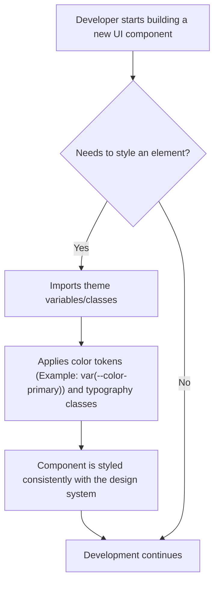

# Analysis Template

> 📋 Template สำหรับการวิเคราะห์ก่อนเริ่มพัฒนา Feature

---

## 📌 Feature Information

| รายการ | รายละเอียด |
|--------|-----------|
| **Feature Name** | Design System Foundation: Colors and Typography |
| **Issue URL** | [#4](https://github.com/owner/repo/issues/4) |
| **Date** | 2023-10-27 |
| **Analyst** | Luma AI (Senior Technical Analyst) |
| **Priority** | 🔴 High |
| **Status** | 📝 Draft |

---

## 1. Requirement Analysis

### 1.1 Problem Statement

> อธิบายปัญหาที่ต้องการแก้ไข

```
The current development process lacks a centralized and consistent design system. This results in UI inconsistencies across different pages and components, as developers manually select colors and typography styles. This slows down development, increases maintenance overhead, and weakens the brand's visual identity.
```

### 1.2 User Stories

| # | As a | I want to | So that |
|---|------|-----------|---------|
| 1 | Developer | use predefined color variables (e.g., primary, secondary, text, background) | I can apply consistent branding across all components without hardcoding hex values. |
| 2 | Developer | use predefined typography styles or components (e.g., H1, Body, Caption) | I can ensure consistent font sizes, weights, and line heights throughout the application. |
| 3 | Designer | have the implemented colors and typography match the design specifications exactly | the final product is visually aligned with the brand guidelines and user experience is cohesive. |

### 1.3 Acceptance Criteria

- [ ] **AC1:** A global theme or CSS variable file is created defining the core color palette, including primary (`#0A192F`), secondary (`#F59E0B`), and their variations (e.g., light, dark, text, background, error, success).
- [ ] **AC2:** A global CSS file or theme configuration defines a typography scale for headings (h1-h6), body text, and other common text elements.
- [ ] **AC3:** The new color and typography tokens are easily accessible for developers to use in CSS, SCSS, or JS-in-CSS contexts.
- [ ] **AC4:** A documentation page (e.g., in Storybook) is created to showcase the color palette and typography scale for easy reference.

---

## 2. Feature Analysis

### 2.1 User Flow

> This flow describes the developer experience when using the new design system.



### 2.2 Screen/Page Requirements

| หน้าจอ | Actions | Components |
|--------|---------|------------|
| Design System Docs (Storybook) | View available colors and their variable names. View typography styles and their class/component names. | Color Palette Swatches, Typography Specimen (showing H1, H2, Body, etc.) |

### 2.3 Input/Output Specification

> Not applicable for this feature, as it does not involve user input or data processing. It is a foundational setup for the codebase.

#### Inputs

| Field | Type | Required | Validation |
|-------|------|----------|------------|
| N/A | - | - | - |

#### Outputs

| Field | Type | Description |
|-------|------|-------------|
| N/A | - | - |

---

## 3. Impact Analysis

### 3.1 Affected Components

| Component | Impact Level | Description |
|-----------|--------------|-------------|
| **Global Styles / Theme Provider** | 🔴 High | This is the core implementation area. New files will be created or existing ones (e.g., `globals.css`, `ThemeProvider`) will be heavily modified to define the design tokens. |
| **All Existing UI Components** | 🟡 Medium | All existing buttons, inputs, cards, layouts, etc., will need to be refactored over time to use the new design tokens instead of hardcoded styles. This is a broad but low-complexity change per component. |
| **Frontend Build Configuration** | 🟢 Low | May require minor adjustments to import new CSS files or configure a theming library (e.g., `tailwind.config.js`). |

### 3.2 Breaking Changes

- [ ] **BC1:** Applying new global typography styles (e.g., for `body`, `h1`) might override existing component-specific styles, potentially causing visual regressions in un-refactored parts of the application.

### 3.3 Backward Compatibility Plan

```
A phased approach will be used to minimize disruption:
1.  **Implementation:** Create and merge the core design system files (colors, typography) into the main branch.
2.  **Adoption for New Work:** Mandate that all *new* features and components built from this point forward must use the new design tokens.
3.  **Gradual Refactoring:** Create technical debt tickets in the backlog to refactor existing pages and components one by one. This allows for controlled updates and easier visual regression testing.
```

---

## 4. Feasibility Analysis

### 4.1 Technical Feasibility

| คำถาม | คำตอบ | หมายเหตุ |
|-------|-------|----------|
| เทคโนโลยีรองรับหรือไม่? | ✅ | This is a standard practice supported by all modern frontend frameworks (CSS Custom Properties, CSS-in-JS, Tailwind CSS). |
| ทีมมี Skills เพียงพอหรือไม่? | ✅ | This is a fundamental frontend development skill. |
| Infrastructure รองรับหรือไม่? | ✅ | No infrastructure changes are required. |

### 4.2 Time Feasibility

| ประเด็น | รายละเอียด |
|--------|-----------|
| **Estimated Effort** | 3-5 days | Includes initial setup, defining variables, creating documentation, and refactoring one sample component. |
| **Deadline** | N/A | Should be prioritized for the next available sprint. |
| **Buffer Time** | 2 days | For potential tooling setup issues or extended team discussion on token naming conventions. |
| **Feasible?** | ✅ | The effort is small and well-understood. |

### 4.3 Budget Feasibility

| รายการ | ค่าใช้จ่าย | หมายเหตุ |
|--------|-----------|----------|
| Developer Time | Internal Cost | This is an internal development effort with no external costs. |
| **Total** | **N/A** | |

---

## 5. Security Analysis

> This feature is focused on UI styling and has no direct impact on data handling, authentication, or business logic. Therefore, security risks are negligible.

### 5.1 Sensitive Data

| ข้อมูล | Sensitivity Level | Protection Method |
|--------|------------------|-------------------|
| N/A | - | - |

### 5.2 Attack Vectors

| Vector | Risk Level | Mitigation |
|--------|-----------|------------|
| N/A | - | - |

### 5.3 Authentication & Authorization

```
Not applicable for this feature.
```

---

## 6. Performance & Scalability Analysis

### 6.1 Performance Targets

| Metric | Target | Current |
|--------|--------|---------|
| First Contentful Paint (FCP) | No degradation | N/A |
| CSS File Size | Minimal increase | N/A |
| Error Rate | N/A | N/A |

> **Note:** Using CSS variables can slightly improve performance by reducing CSS code duplication, leading to a smaller overall bundle size.

### 6.2 Scalability Plan

| Scenario | Expected Users | Scaling Strategy |
|----------|---------------|------------------|
| Normal | N/A | The design system itself is a scalability strategy for the UI. It allows the team to build more features faster and more consistently. |
| Peak | N/A | The system will be designed to be extensible, allowing new colors, fonts, and spacing units to be added easily as the product grows. |
| Growth (1yr) | N/A | The centralized nature of the system ensures that future re-branding or UI refresh efforts can be executed efficiently by updating the core theme files. |

---

## 7. Gap Analysis

| ด้าน | As-Is (ปัจจุบัน) | To-Be (ต้องการ) | Gap |
|------|-----------------|-----------------|-----|
| **UI Consistency** | Inconsistent; components have unique, hardcoded styles. | All components share a consistent visual language defined by the design system. | Lack of a centralized, single source of truth for styling (design tokens). |
| **Development Speed** | Slow; developers spend time deciding on styles and ensuring they match designs. | Faster; developers can quickly apply pre-defined styles, focusing on logic instead of visuals. | Absence of reusable and standardized styling utilities. |
| **Maintainability** | Difficult; changing a brand color requires finding and replacing it in dozens of files. | Easy; a brand color change can be done by updating a single variable in the theme file. | A decentralized and non-systematic approach to styling. |

---

## 8. Risk Analysis

| Risk | Probability | Impact | Score | Mitigation Plan |
|------|-------------|--------|-------|-----------------|
| **Visual Regressions** | 🟡 Medium | 🟡 Medium | 4 | Implement a gradual refactoring plan. Use visual snapshot testing (e.g., with Storybook) to catch unintended changes before they reach production. |
| **Poor Developer Adoption** | 🟢 Low | 🟡 Medium | 2 | Create clear and accessible documentation (Storybook). Conduct a brief team walkthrough to demonstrate how to use the new system. Enforce usage through code reviews. |

> **Risk Score:** Probability × Impact (High=3, Medium=2, Low=1)

---

## 9. Summary & Recommendations

### 9.1 Analysis Summary

| หมวด | Status | Key Findings |
|------|--------|--------------|
| Requirement | ✅ Clear | The need for a consistent and scalable UI foundation is well-defined. |
| Feature | ✅ Defined | The scope is limited to colors and typography, making it a manageable first step. |
| Impact | 🟡 Medium | The change will touch many files over time, requiring a careful rollout strategy. |
| Feasibility | ✅ Feasible | The task is technically straightforward and requires no special resources. |
| Security | ✅ Acceptable | No security implications. |
| Performance | ✅ Acceptable | No negative performance impact is expected; potential for minor improvements. |
| Risk | ⚠️ Some Risks | The primary risk is visual regression, which can be managed with testing and a phased rollout. |

### 9.2 Recommendations

1.  **Proceed with Implementation:** This is a high-priority foundational task that will unlock significant long-term benefits in development speed and product quality.
2.  **Use CSS Custom Properties:** Implement the design tokens using CSS Custom Properties (`--color-primary: #0A192F;`) as they are framework-agnostic and offer excellent performance and flexibility.
3.  **Prioritize Documentation:** Set up a Storybook or a similar tool concurrently with the implementation. Good documentation is key to developer adoption.

### 9.3 Next Steps

- [ ] Create a technical task to set up the base files for the design system (e.g., `styles/theme.css`).
- [ ] Define and implement the full color palette and typography scale based on design specifications.
- [ ] Set up a Storybook instance and create documentation pages for the new tokens.
- [ ] Schedule a code review and a team demo upon completion.

---

## 📎 Appendix

### Related Documents

- [Link to PRD] (N/A)
- [Link to Design Docs] (e.g., Figma link)
- [Link to API Specs] (N/A)

### Sign-off

| Role | Name | Date | Signature |
|------|------|------|-----------|
| Analyst | Luma AI | 2023-10-27 | ✅ |
| Tech Lead | [Name] | [Date] | ⬜ |
| PM | [Name] | [Date] | ⬜ |