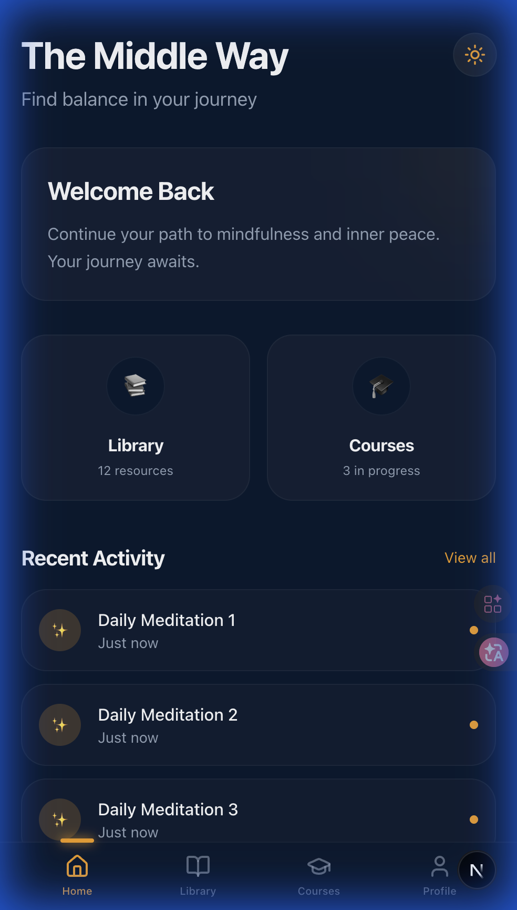

# Issue #13: Light/Dark Theme Support

**Date:** 2026-02-10  
**Status:** 🔄 In Progress (Web ✅ | Android ✅ | iOS ✅)  
**Issue:** [#13](https://github.com/oatrice/TheMiddleWay-Metadata/issues/13)  
**Milestone:** [v0.2.0 - Foundation](https://github.com/oatrice/TheMiddleWay-Metadata/milestone/1)

---

## Summary

ระบบสลับธีมระหว่าง **Bright Sky (Light)** และ **Deep Cosmos (Dark)** ทุก platform  
ผู้ใช้สลับธีมผ่านปุ่ม toggle ที่ header — ระบบจำค่าที่เลือกไว้แม้ปิดแอปแล้วเปิดใหม่

---

## 🎨 Color Palettes

### ☀️ Bright Sky (Light Mode) — Default

| Token | Hex | ตัวอย่าง | ใช้กับ |
|-------|-----|---------|-------|
| Sky White | `#EFF6FF` | 🟦 | Background |
| Bright Blue | `#2563EB` | 🔵 | Primary / Accent |
| Sky Surface | `#DBEAFE` | 🔷 | Cards / Surface |
| Deep Blue | `#1E3A5F` | 🔹 | Text Primary |
| Blue Gray | `#64748B` | ⬜ | Text Secondary |
| Sky Border | `#BFDBFE` | ⬜ | Borders |

### 🌙 Deep Cosmos (Dark Mode)

| Token | Hex | ตัวอย่าง | ใช้กับ |
|-------|-----|---------|-------|
| Navy | `#0A192F` | 🟫 | Background |
| Amber | `#F59E0B` | 🟡 | Primary / Accent |
| Slate Dark | `#1E293B` | ⬛ | Cards / Surface |
| Ivory | `#F8FAFC` | ⬜ | Text Primary |
| Slate Light | `#94A3B8` | ⬜ | Text Secondary |
| Slate Border | `#334155` | ⬛ | Borders |

---

## 📱 Platform Implementation

### 🌐 Web (Next.js + CSS Variables)

| Component | File | Role |
|-----------|------|------|
| CSS Variables | `globals.css` | Color tokens ทั้ง 2 ธีม |
| Theme Hook | `hooks/useTheme.ts` | State management + localStorage |
| Theme Context | `components/ThemeProvider.tsx` | React Context |
| Toggle Button | `components/ThemeToggle.tsx` | Sun/Moon icon button |

**Persistence:** `localStorage` key `theme-mode`

#### Screenshots

| Light Mode (Bright Sky ☀️) | Dark Mode (Deep Cosmos 🌙) |
|---|---|
|  |  |

---

### 🤖 Android (Jetpack Compose + Material 3)

| Component | File | Role |
|-----------|------|------|
| Color Palette | `ui/theme/Color.kt` | `AppColors.Light` + `AppColors.Dark` |
| Theme Composable | `ui/theme/Theme.kt` | `WarmSanctuaryColorScheme` + `DeepCosmosColorScheme` |
| Theme State | `ui/theme/ThemeState.kt` | `ThemeViewModel` + SharedPreferences |
| Toggle Button | `ui/screens/home/HomeScreen.kt` | Sun/Moon icon in TopAppBar |

**Persistence:** `SharedPreferences` key `isDarkMode`

#### Screenshots

| Light Mode (Bright Sky ☀️) | Dark Mode (Deep Cosmos 🌙) |
|---|---|
|  |  |

> 📸 *Screenshots จะเพิ่มจาก Emulator/อุปกรณ์จริงเร็วๆ นี้*

---

### 🍎 iOS (SwiftUI + @AppStorage)

| Component | File | Role |
|-----------|------|------|
| Color Palette | `Core/Theme/AppColors.swift` | `Light` + `Dark` enums + Dynamic tokens |
| Theme Config | `Core/Theme/ThemeConfig.swift` | Helper functions + storage key |
| Theme Stack | `Core/Theme/AppTheme.swift` | `ThemedNavigationStack` |
| Toggle Button | `Features/Home/HomeView.swift` | SF Symbol icon in toolbar |

**Persistence:** `@AppStorage("isDarkMode")` → UserDefaults

#### Screenshots

| Light Mode (Bright Sky ☀️) | Dark Mode (Deep Cosmos 🌙) |
|---|---|
|  |  |

> 📸 *Screenshots จะเพิ่มจาก Simulator เร็วๆ นี้*

---

## 🔧 Technical Details

### Default Theme
เริ่มต้นทุก platform ด้วย **Light Mode (Bright Sky)** — เปลี่ยนได้เร็วๆ นี้ผ่าน config:

| Platform | Config Location | Default |
|----------|----------------|---------|
| Web | `hooks/useTheme.ts` → `DEFAULT_THEME` | `"light"` |
| Android | `ThemeState.kt` → `DEFAULT_IS_DARK` | `false` |
| iOS | `@AppStorage` default | `false` |

### Cross-Platform Consistency

สีทุก token ตรงกันทุก platform:

```
Web (CSS)        → #EFF6FF / #2563EB / #DBEAFE
Android (Compose) → 0xFFEFF6FF / 0xFF2563EB / 0xFFDBEAFE
iOS (SwiftUI)     → "#EFF6FF" / "#2563EB" / "#DBEAFE"
```

---

## Related Issues

| Issue | Title | Relation |
|-------|-------|----------|
| [#14](https://github.com/oatrice/TheMiddleWay-Metadata/issues/14) | Design System Implementation | Provides color foundation |
| [#15](https://github.com/oatrice/TheMiddleWay-Metadata/issues/15) | Persistence Layer | Theme uses localStorage/UserDefaults/SharedPrefs |

---

## Next Steps

- [ ] Capture real screenshots จาก Android Emulator + iOS Simulator
- [ ] เพิ่ม theme animations (matching Issue #17)
- [ ] เพิ่ม system theme auto-detect (follow OS setting)
