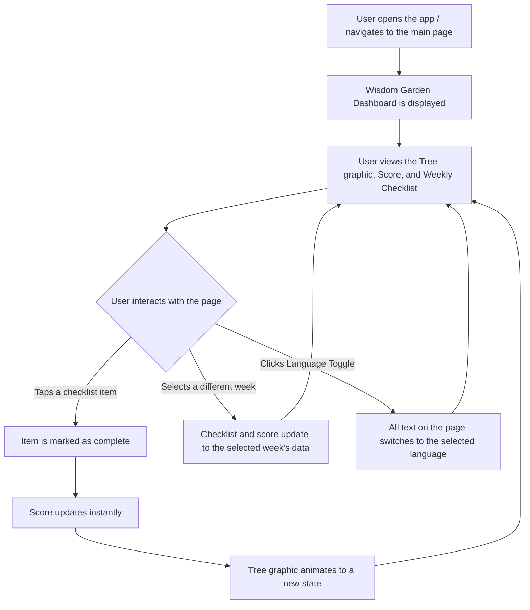

# Analysis Template

> 📋 Template สำหรับการวิเคราะห์ก่อนเริ่มพัฒนา Feature

---

## 📌 Feature Information

| รายการ | รายละเอียด |
|--------|-----------|
| **Feature Name** | สร้างหน้า "สวนแห่งปัญญา" (Wisdom Garden Dashboard) |
| **Issue URL** | [#1](https://github.com/placeholder/repo/issues/1) |
| **Date** | 2023-10-27 |
| **Analyst** | Luma AI (Senior Technical Analyst) |
| **Priority** | 🔴 High |
| **Status** | 📝 Draft |

---

## 1. Requirement Analysis

### 1.1 Problem Statement

> อธิบายปัญหาที่ต้องการแก้ไข

```
ผู้ใช้งานปัจจุบันไม่มีหน้าจอหลัก (Dashboard) ที่จะรวมศูนย์และแสดงภาพความก้าวหน้าในการปฏิบัติธรรมของตนเอง ทำให้ขาดแรงจูงใจและไม่เห็นผลลัพธ์ที่เป็นรูปธรรม นอกจากนี้ยังไม่มีจุดที่ชัดเจนในการเข้าถึงรายการสิ่งที่ต้องปฏิบัติในแต่ละวันหรือสัปดาห์ ทำให้ประสบการณ์การใช้งานไม่ต่อเนื่องและไม่เป็นมิตรต่อผู้ใช้ใหม่
```

### 1.2 User Stories

| # | As a | I want to | So that |
|---|------|-----------|---------|
| 1 | User | see my practice progress visualized as a growing tree or flower | I can feel motivated and see a tangible, beautiful representation of my efforts. |
| 2 | User | view a clear checklist of my weekly practices categorized by type (e.g., Giving, Ethics) | I know exactly what I need to do each day to stay on track. |
| 3 | User | mark a practice as complete and see my score and the tree graphic update immediately | I get instant positive feedback for my actions. |
| 4 | User | switch between different weeks (1-8) | I can review my past performance or plan for upcoming weeks. |
| 5 | International User | switch the interface language between Thai and English | I can use the application comfortably in my preferred language. |

### 1.3 Acceptance Criteria

- [ ] **AC1:** หน้าจอสามารถแสดงผลได้อย่างถูกต้องและสวยงามบนอุปกรณ์เดสก์ท็อปและมือถือ (Responsive Design)
- [ ] **AC2:** ผู้ใช้สามารถกดปุ่มเปลี่ยนภาษา (TH/EN) และข้อความทั้งหมดบนหน้าจอจะเปลี่ยนตามภาษาที่เลือก
- [ ] **AC3:** เมื่อผู้ใช้กดติ๊กถูกที่รายการปฏิบัติธรรม (Checklist) คะแนนรวมและกราฟิกต้นไม้จะต้องอัปเดตทันทีโดยไม่ต้องโหลดหน้าใหม่
- [ ] **AC4:** ผู้ใช้สามารถกดเลือกสัปดาห์ (Week 1-8) เพื่อดูข้อมูลของสัปดาห์นั้นๆ ได้

---

## 2. Feature Analysis

### 2.1 User Flow



### 2.2 Screen/Page Requirements

| หน้าจอ | Actions | Components |
|--------|---------|------------|
| **Wisdom Garden Dashboard** | - Check/uncheck a practice item<br>- Select a week<br>- Toggle language (TH/EN) | - **Header:** Contains Language Toggle and Week Selector.<br>- **Wisdom Garden Visualizer:** Displays the tree/flower graphic and the total score (e.g., 14/70).<br>- **Practice Checklist:** A scrollable list of `PracticeCard` components.<br>- **Practice Card:** An individual checklist item with a checkbox, title, and category. |

### 2.3 Input/Output Specification

#### Inputs

| Field | Type | Required | Validation |
|-------|------|----------|------------|
| userInteraction.checkItem | object | ✅ | Must contain `itemId` and `completedState` (boolean). |
| userInteraction.selectWeek | number | ✅ | Must be an integer between 1 and 8. |
| userInteraction.selectLang | string | ✅ | Must be 'TH' or 'EN'. |

#### Outputs

*(Assumption: Based on a future API. For now, this will be handled by client-side state management with mock data.)*

| Field | Type | Description |
|-------|------|-------------|
| weeklyProgress.week | number | The week number (1-8). |
| weeklyProgress.totalScore | number | The user's accumulated score for that week. |
| weeklyProgress.maxScore | number | The maximum possible score for that week. |
| weeklyProgress.practices | array[object] | A list of practice items for the week. |
| practice.id | string | Unique identifier for the practice. |
| practice.title | string | The name of the practice (e.g., "Morning Meditation"). |
| practice.category | string | The category (e.g., "ศีล", "ทาน"). |
| practice.completed | boolean | The completion status. |

---

## 3. Impact Analysis

### 3.1 Affected Components

| Component | Impact Level | Description |
|-----------|--------------|-------------|
| **Web Frontend (React)** | 🔴 High | Creation of a new primary page, several new components (`WeekSelector`, `PracticeCard`, `WisdomGardenVisualizer`), and state management logic. |
| **Mobile (iOS/Android)** | 🔴 High | This feature will need to be implemented as a new native screen, becoming the core dashboard of the mobile app. Requires new UI components and logic. |
| **Backend API (Python/Go)** | 🟡 Medium | New endpoints will be required to: 1. Fetch weekly practice lists and user progress. 2. Persist user progress when an item is checked. |
| **Database Schema** | 🟡 Medium | New tables will be needed to store `users`, `weekly_practices`, and `user_progress` (linking users to practices with a completion status). |
| **UI/UX Component Library** | 🟢 Low | New reusable components will be created, which can be added to the shared library. No existing components are heavily modified. |
| **Localization (i18n)** | 🟡 Medium | A new translation file/namespace for this page will be needed to support TH/EN languages. |

### 3.2 Breaking Changes

- [ ] **None:** This is a new feature and does not alter or remove existing functionality.

### 3.3 Backward Compatibility Plan

```
Since this is a new feature, backward compatibility is not a major concern for existing clients. However, when the backend API is developed, it should be versioned (e.g., /api/v1/...) to ensure that future changes do not break older versions of the mobile or web clients.
```

---

## 4. Feasibility Analysis

### 4.1 Technical Feasibility

| คำถาม | คำตอบ | หมายเหตุ |
|-------|-------|----------|
| เทคโนโลยีรองรับหรือไม่? | ✅ | The specified stack (React, Tailwind, Framer Motion, Lucide) is modern, well-supported, and suitable for building this UI. |
| ทีมมี Skills เพียงพอหรือไม่? | ✅ | The required skills are standard for modern frontend development. No specialized or niche knowledge is required. |
| Infrastructure รองรับหรือไม่? | ✅ | For the initial mock-data version, no infrastructure is needed. For the backend version, standard cloud infrastructure (e.g., AWS, GCP) will suffice. |

### 4.2 Time Feasibility

| ประเด็น | รายละเอียด |
|--------|-----------|
| **Estimated Effort** | **Frontend (with mock data):** 5-8 working days.<br>**Backend API:** 3-5 working days.<br>**Mobile (per platform):** 8-12 working days. |
| **Deadline** | N/A (To be defined by Project Manager) |
| **Buffer Time** | 3 days (for frontend) |
| **Feasible?** | ✅ | The scope is well-defined and the effort is manageable within a typical sprint. |

### 4.3 Budget Feasibility

| รายการ | ค่าใช้จ่าย | หมายเหตุ |
|--------|-----------|----------|
| Developer Hours | [Internal Cost] | Based on the estimated effort above. |
| Third-party Libraries | $0 | All specified libraries (Tailwind, Framer Motion, Lucide) are open-source. |
| **Total** | **[Internal Cost]** | No external budget is required for this phase. |

---

## 5. Security Analysis

### 5.1 Sensitive Data

| ข้อมูล | Sensitivity Level | Protection Method |
|--------|------------------|-------------------|
| User Progress Data | 🟡 Sensitive | Data should be tied to a user account and only accessible by that authenticated user. Transmitted over HTTPS. |
| User ID | 🟡 Sensitive | Standard access control and authentication mechanisms. |

### 5.2 Attack Vectors

| Vector | Risk Level | Mitigation |
|--------|-----------|------------|
| Cross-Site Scripting (XSS) | 🟡 Medium | Ensure all user-generated content (if any in the future) is properly sanitized. React helps mitigate this by default. |
| Cross-Site Request Forgery (CSRF) | 🟡 Medium | The backend endpoint for updating progress should be protected with anti-CSRF tokens if using session-based authentication. |
| Unauthorized Data Access | 🔴 High | The API must validate that the authenticated user has permission to view or modify the requested progress data. |

### 5.3 Authentication & Authorization

```
This page must be accessible only to authenticated users. API requests to fetch or update progress data must include a valid authentication token (e.g., JWT Bearer token). The backend must authorize every request, ensuring a user can only modify their own data.
```

---

## 6. Performance & Scalability Analysis

### 6.1 Performance Targets

| Metric | Target | Current |
|--------|--------|---------|
| Page Load Time (LCP) | < 2.5s | N/A |
| API Response Time | < 200ms | N/A |
| Animation Frame Rate | > 50fps | N/A |
| Error Rate | < 0.1% | N/A |

### 6.2 Scalability Plan

| Scenario | Expected Users | Scaling Strategy |
|----------|---------------|------------------|
| Normal | 1,000 DAU | Standard serverless functions or a small containerized service for the API. Read replicas for the database if needed. |
| Peak | 10,000 DAU | Auto-scaling rules for the API service. Use of a CDN to serve static assets. Database connection pooling. |
| Growth (1yr) | 50,000+ DAU | Optimize database queries, introduce caching layers (e.g., Redis) for frequently accessed data like weekly practice lists. |

---

## 7. Gap Analysis

| ด้าน | As-Is (ปัจจุบัน) | To-Be (ต้องการ) | Gap |
|------|-----------------|-----------------|-----|
| **User Experience** | No central dashboard. Users lack a clear view of their progress and tasks. | An engaging, centralized dashboard that visualizes progress and lists tasks. | The entire "Wisdom Garden" feature needs to be designed and built from scratch. |
| **Frontend** | The dashboard page and its components do not exist. | A fully functional, responsive page built with React and Tailwind CSS. | All UI components, state logic, and animations need to be developed. |
| **Backend** | No API endpoints exist to support this feature. | Endpoints for fetching and updating user practice progress. | API development, database schema design, and deployment are required. |

---

## 8. Risk Analysis

| Risk | Probability | Impact | Score | Mitigation Plan |
|------|-------------|--------|-------|-----------------|
| **Animation Performance** | 🟡 Medium | 🟡 Medium | 4 | Test animations on a range of devices. Use CSS transforms for animations where possible. Provide an option to reduce or disable animations in settings. |
| **Data Contract Mismatch** | 🔴 High | 🟡 Medium | 6 | Define a clear and versioned API contract between frontend and backend teams before implementation begins. Use tools like OpenAPI/Swagger. |
| **Scope Creep** | 🟡 Medium | 🟡 Medium | 4 | Adhere strictly to the features defined in the issue. Defer requests for more complex graphics or interactions to a future iteration. |
| **Inconsistent UI/UX on Mobile** | 🟡 Medium | 🔴 High | 6 | Ensure mobile (iOS/Android) design and development teams are aligned with the web implementation's look, feel, and functionality. Share components and design tokens where possible. |

> **Risk Score:** Probability × Impact (High=3, Medium=2, Low=1)

---

## 9. Summary & Recommendations

### 9.1 Analysis Summary

| หมวด | Status | Key Findings |
|------|--------|--------------|
| Requirement | ✅ Clear | The requirements are well-defined and actionable for the frontend implementation with mock data. |
| Feature | ✅ Defined | The user flow, components, and interactions are clearly specified. |
| Impact | 🟡 Medium | This is a significant new feature impacting web, mobile, and backend. Cross-team coordination is essential. |
| Feasibility | ✅ Feasible | The project is technically feasible with the current team and technology stack. The estimated effort is reasonable. |
| Security | ⚠️ Needs Review | Standard security practices are required, especially for the backend API which will handle user data. |
| Performance | ✅ Acceptable | No major performance bottlenecks are anticipated, but animation smoothness should be monitored. |
| Risk | 🟡 Medium | The primary risks are related to cross-team coordination (API contract) and ensuring a consistent cross-platform experience. |

### 9.2 Recommendations

1. **Define API Contract First:** Prioritize defining the data structures and endpoints for fetching and updating user progress. This will prevent rework and allow parallel development between frontend and backend teams.
2. **Develop Reusable Components:** Build the `PracticeCard`, `WeekSelector`, and `LanguageToggle` as generic, reusable components to ensure consistency and speed up future development, including on mobile platforms.
3. **Prototype Animations:** Create a quick prototype for the tree growth animation using Framer Motion to validate performance and user experience before integrating it into the full application.

### 9.3 Next Steps

- [ ] Create high-fidelity UI mockups in Figma based on the issue's design notes.
- [ ] Begin frontend development of the page and components using the defined mock data structure.
- [ ] Draft the OpenAPI/Swagger specification for the required backend endpoints.
- [ ] Schedule a kickoff meeting with the mobile and backend teams to align on the implementation plan.

---

## 📎 Appendix

### Related Documents

- [Link to PRD] (To be created)
- [Link to Design Docs] (To be created)
- [Link to API Specs] (To be created)

### Sign-off

| Role | Name | Date | Signature |
|------|------|------|-----------|
| Analyst | Luma AI | 2023-10-27 | ✅ |
| Tech Lead | [Name] | [Date] | ⬜ |
| PM | [Name] | [Date] | ⬜ |