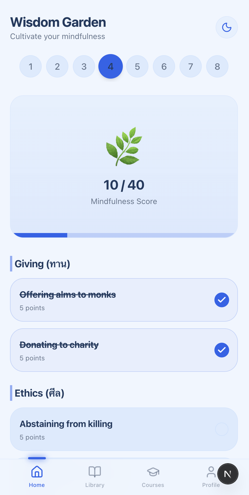

# 📋 Testing Guide: Wisdom Garden Dashboard

> **Feature:** [Issue #1] สร้างหน้า "สวนแห่งปัญญา" (Wisdom Garden Dashboard)  
> **Status:** Ready for Testing
> **Preview:** Check PR Comment for *Stable Branch Alias* (Auto-generated)
> **Production (Main Branch):** [https://the-middle-way.vercel.app/](https://the-middle-way.vercel.app/)

---

## 📸 Screenshots

| Platform | Web | Android | iOS |
|----------|------------|------------|------------|
| **Light Mode** |  |  |  |
---

## 🧪 Test Cases

### 1. Header & Navigation

| ID | Test Case | Action | Expected Result | Status |
|----|-----------|--------|-----------------|--------|
| **NAV-01** | **Check Header Display** | Open the app to the main screen. | Header shows "Wisdom Garden" (or "สวนแห่งปัญญา") correctly. | ⬜️ |
| **NAV-02** | **Week Selector - Display** | Observe the week selector bar. | Shows weeks 1-8. Current week is highlighted. | ⬜️ |
| **NAV-03** | **Week Selector - Selection** | Tap on a different week (e.g., Week 2). | - Highlighting moves to the selected week. - The content (tree & checklist) updates to reflect that week's data. | ⬜️ |

### 2. Wisdom Garden Visualization

| ID | Test Case | Action | Expected Result | Status |
|----|-----------|--------|-----------------|--------|
| **VIS-01** | **Initial State** | Select a week with 0 points. | - Tree icon shows a "Seed" or initial state. - Progress bar is empty. - Score text shows "0/XX". | ⬜️ |
| **VIS-02** | **Progress Update** | Complete practice items to increase score. | - Progress bar fills up proportionally. - Score text updates (e.g., "10/70"). - Tree icon changes (grows) as score thresholds are met. | ⬜️ |
| **VIS-03** | **Max Progress** | Complete all items for the week. | - Progress bar is full (100%). - Tree icon is at max growth stage (e.g., Blooming Tree). | ⬜️ |

### 3. Practice Checklist

| ID | Test Case | Action | Expected Result | Status |
|----|-----------|--------|-----------------|--------|
| **CHK-01** | **List Display** | Scroll down to the checklist area. | Items are grouped by category (e.g., Giving, Ethics). Titles and points are visible. | ⬜️ |
| **CHK-02** | **Check Item** | Tap an incomplete checkbox. | - Checkbox becomes checked (Color changes to Primary/Success). - Total score increases immediately. - Tree visualization updates. | ⬜️ |
| **CHK-03** | **Uncheck Item** | Tap a completed checkbox. | - Checkbox becomes unchecked. - Total score decreases. - Tree visualization updates. | ⬜️ |
| **CHK-04** | **Persistence** | Check an item, switch to another week, then switch back. | The item should remain checked. | ⬜️ |

### 4. Integration & UI

| ID | Test Case | Action | Expected Result | Status |
|----|-----------|--------|-----------------|--------|
| **UI-01** | **Theme Consistency** | Switch between Light and Dark mode. | - Colors adapt correctly (e.g., text remains readable, background changes). - Tree/Progress colors remain visible and meaningful. | ⬜️ |
| **UI-02** | **Responsiveness** | (Web) Resize browser window. | Layout adjusts gracefully (Mobile view <-> Desktop view). | ⬜️ |

---

## 📝 Notes

- **Android:** Ensure verify with `app-debug.apk` or run from Android Studio.
- **iOS:** Ensure `AppColors` are working correctly (Blue/Amber theme).
- **Web:** LocalStorage is used for persistence in this version.
