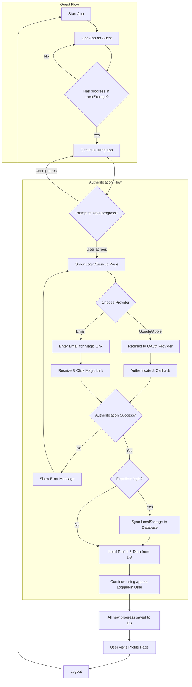

# Analysis Template

> 📋 Template สำหรับการวิเคราะห์ก่อนเริ่มพัฒนา Feature

---

## 📌 Feature Information

| รายการ | รายละเอียด |
|--------|-----------|
| **Feature Name** | ระบบสมาชิกและการรักษาความปลอดภัย (User Authentication & Data Sync) |
| **Issue URL** | [#14](https://github.com/owner/repo/issues/14) |
| **Date** | 2023-10-27 |
| **Analyst** | Luma AI (Senior Technical Analyst) |
| **Priority** | 🔴 High |
| **Status** | 📝 Draft |

---

## 1. Requirement Analysis

### 1.1 Problem Statement

> อธิบายปัญหาที่ต้องการแก้ไข

```
ปัจจุบันข้อมูลความก้าวหน้าของผู้ใช้ (Progress) ถูกจัดเก็บไว้ใน LocalStorage ของเบราว์เซอร์เท่านั้น ซึ่งมีความเสี่ยงสูงต่อการสูญหายหากผู้ใช้เปลี่ยนอุปกรณ์, ล้างแคช, หรืออุปกรณ์เสียหาย ทำให้ผู้ใช้สูญเสียข้อมูลที่สะสมมาทั้งหมด ปัญหานี้ยังเป็นอุปสรรคต่อการพัฒนาฟีเจอร์ที่ต้องการข้อมูลข้ามอุปกรณ์ในอนาคต เช่น ระบบสมาชิกพรีเมียม
```

### 1.2 User Stories

| # | As a | I want to | So that |
|---|------|-----------|---------|
| 1 | New or existing user | sign up or log in using my Google or Apple account | I can create an account easily and securely without needing to remember a new password. |
| 2 | New or existing user | log in by clicking a link sent to my email (Magic Link) | I can access my account without a password, which is convenient and secure. |
| 3 | Logged-in user | have my progress automatically saved to the cloud | I don't lose my data when I switch devices or clear my browser cache. |
| 4 | First-time logged-in user | have my existing progress from my device migrated to my new account | I don't have to start over and can seamlessly continue my journey. |
| 5 | Guest user | try the application and accumulate progress without being forced to log in | I can experience the value of the app before committing to creating an account. |

### 1.3 Acceptance Criteria

- [ ] **AC1:** ผู้ใช้สามารถลงทะเบียนและเข้าสู่ระบบผ่าน Google OAuth ได้สำเร็จ
- [ ] **AC2:** ผู้ใช้สามารถลงทะเบียนและเข้าสู่ระบบผ่าน Apple Sign-in ได้สำเร็จ
- [ ] **AC3:** ผู้ใช้สามารถเข้าสู่ระบบผ่าน Magic Link ที่ส่งไปยังอีเมลได้สำเร็จ
- [ ] **AC4:** เมื่อผู้ใช้เข้าสู่ระบบครั้งแรก ข้อมูลที่มีอยู่ใน LocalStorage จะต้องถูกย้าย (Migrate) ไปยังฐานข้อมูลบนคลาวด์ของบัญชีผู้ใช้นั้นๆ
- [ ] **AC5:** หลังจากเข้าสู่ระบบแล้ว ความคืบหน้าใหม่ๆ ทั้งหมดจะถูกบันทึกลงฐานข้อมูลโดยตรง
- [ ] **AC6:** ผู้ใช้ที่เข้าสู่ระบบสามารถดูข้อมูลโปรไฟล์พื้นฐาน (ชื่อ, อีเมล) และออกจากระบบได้
- [ ] **AC7:** ระบบต้องรองรับผู้ใช้ทั่วไป (Guest) และมีกลไกเชิญชวนให้สมัครสมาชิกเมื่อผู้ใช้มีคะแนนสะสมถึงเกณฑ์ที่กำหนด โดยไม่เป็นการบังคับ

---

## 2. Feature Analysis

### 2.1 User Flow



### 2.2 Screen/Page Requirements

| หน้าจอ | Actions | Components |
|--------|---------|------------|
| **Login/Sign-up Page/Modal** | - Login with Google<br>- Login with Apple<br>- Login with Email (Magic Link) | - Google Sign-in Button<br>- Apple Sign-in Button<br>- Email Input Field<br>- "Send Magic Link" Button |
| **Profile Page** | - View user information<br>- Logout | - User Avatar<br>- User Name/Email<br>- Logout Button |

### 2.3 Input/Output Specification

#### Inputs

| Field | Type | Required | Validation |
|-------|------|----------|------------|
| Email | string | ✅ | Must be a valid email format |

#### Outputs

| Field | Type | Description |
|-------|------|-------------|
| sessionToken | string | JWT token stored in a secure, HttpOnly cookie to manage user session. |
| userProfile | object | User object containing id, name, email, and image URL. |
| userProgress | object | User's progress data retrieved from the database. |

---

## 3. Impact Analysis

### 3.1 Affected Components

| Component | Impact Level | Description |
|-----------|--------------|-------------|
| **Frontend (Next.js)** | 🔴 High | ต้องสร้าง UI Components ใหม่ (Login, Profile), จัดการสถานะ Authentication (e.g., using Context/Provider), เพิ่ม Logic การเรียก API และการย้ายข้อมูลจาก LocalStorage |
| **Backend API** | 🔴 High | ต้องสร้าง Endpoints ใหม่สำหรับ Authentication callbacks, CRUD operations สำหรับ User Progress, และ User management |
| **Database** | 🔴 High | ต้องออกแบบและสร้าง Schema ใหม่สำหรับตาราง `users`, `accounts`, `sessions`, และ `user_progress` |
| **Data Storage Logic** | 🔴 High | ต้องปรับปรุง Logic เดิมที่ใช้ LocalStorage ให้ตรวจสอบสถานะการ Login ก่อน ถ้า Login แล้วให้ Sync กับ Backend แทน |
| **Mobile (Android/iOS)** | 🟡 Medium | (Assumption) หากมีแอปพลิเคชันบนมือถือ จะต้องนำ Auth flow และ Sync logic ไป implement บนแพลตฟอร์มนั้นๆ ด้วย |

### 3.2 Breaking Changes

- [ ] **BC1:** รูปแบบการจัดเก็บข้อมูลจะเปลี่ยนจาก Client-side (LocalStorage) เป็น Server-side (Database) สำหรับผู้ใช้ที่ลงทะเบียนแล้ว ผู้ใช้ที่ไม่ลงทะเบียนจะยังคงใช้ LocalStorage ต่อไป แต่จะไม่ได้รับประโยชน์จากการซิงค์ข้อมูล

### 3.3 Backward Compatibility Plan

```
แอปพลิเคชันต้องทำงานได้อย่างสมบูรณ์สำหรับผู้ใช้ที่ไม่ได้เข้าสู่ระบบ (Guest) โดยใช้ LocalStorage เหมือนเดิม
กระบวนการย้ายข้อมูล (Migration) จะเกิดขึ้นเพียงครั้งเดียวเมื่อผู้ใช้เข้าสู่ระบบครั้งแรก และต้องออกแบบให้ไม่ทำลายข้อมูลเดิม (Non-destructive) หากการย้ายข้อมูลสำเร็จ ควรมีการทำเครื่องหมายใน LocalStorage เพื่อป้องกันการย้ายซ้ำซ้อน
เมื่อผู้ใช้เข้าสู่ระบบแล้ว แอปพลิเคชันจะยึดข้อมูลจาก Database เป็นหลัก (Source of Truth)
```

---

## 4. Feasibility Analysis

### 4.1 Technical Feasibility

| คำถาม | คำตอบ | หมายเหตุ |
|-------|-------|----------|
| เทคโนโลยีรองรับหรือไม่? | ✅ | NextAuth.js และ Supabase (PostgreSQL) เป็นเครื่องมือมาตรฐานและมีเอกสารประกอบที่ดีเยี่ยมสำหรับงานนี้ |
| ทีมมี Skills เพียงพอหรือไม่? | ✅ | (Assumption) ทีมมีความเชี่ยวชาญใน Next.js และการทำงานกับฐานข้อมูล SQL ซึ่งเป็นทักษะพื้นฐานสำหรับฟีเจอร์นี้ |
| Infrastructure รองรับหรือไม่? | ✅ | Vercel และ Supabase เป็น Managed services ที่สามารถรองรับการขยายตัวได้ดีในช่วงเริ่มต้น |

### 4.2 Time Feasibility

| ประเด็น | รายละเอียด |
|--------|-----------|
| **Estimated Effort** | 3-4 weeks |
| **Deadline** | N/A |
| **Buffer Time** | 1 week |
| **Feasible?** | ✅ |

### 4.3 Budget Feasibility

| รายการ | ค่าใช้จ่าย | หมายเหตุ |
|--------|-----------|----------|
| **Auth Library (NextAuth.js)** | Free | Open Source |
| **Database (Supabase)** | Free Tier (เริ่มต้น) | ค่าใช้จ่ายจะเพิ่มขึ้นตามจำนวนผู้ใช้และการใช้งาน |
| **Email Service (Resend/SES)** | Free Tier (เริ่มต้น) | สำหรับส่ง Magic Link ค่าใช้จ่ายจะเพิ่มตามจำนวนอีเมลที่ส่ง |
| **Total** | **~ $0/month (เริ่มต้น)** | **ค่าใช้จ่ายจะเกิดขึ้นเมื่อมีการใช้งานเกิน Free Tier** |

---

## 5. Security Analysis

### 5.1 Sensitive Data

| ข้อมูล | Sensitivity Level | Protection Method |
|--------|------------------|-------------------|
| **User PII (Email, Name)** | 🔴 Critical | Encryption at Rest, Access Control, Request minimal OAuth scopes |
| **Auth Tokens (Session, OAuth)** | 🔴 Critical | Use secure, HttpOnly cookies for session tokens. Encrypt provider tokens in DB. |
| **User Progress Data** | 🟡 Sensitive | Row-Level Security (RLS) ในฐานข้อมูลเพื่อให้ผู้ใช้เข้าถึงได้เฉพาะข้อมูลของตนเอง |

### 5.2 Attack Vectors

| Vector | Risk Level | Mitigation |
|--------|-----------|------------|
| **IDOR (Insecure Direct Object References)** | 🔴 High | ใช้ Row-Level Security (RLS) ใน Supabase และตรวจสอบสิทธิ์ผู้ใช้ในทุก API request ที่มีการเข้าถึงข้อมูล |
| **CSRF (Cross-Site Request Forgery)** | 🟡 Medium | NextAuth.js มีการป้องกัน CSRF ในตัวโดยใช้ double submit cookie pattern |
| **XSS (Cross-Site Scripting)** | 🟡 Medium | ใช้ความสามารถในการป้องกัน XSS ของ React/Next.js และหลีกเลี่ยงการใช้ `dangerouslySetInnerHTML` |

### 5.3 Authentication & Authorization

```
- **Authentication:** ใช้ OAuth 2.0 (Google, Apple) และ Token-based (Magic Link) ผ่าน Library NextAuth.js ซึ่งจะจัดการ Session ด้วย JWT ที่เก็บใน Secure, HttpOnly Cookie
- **Authorization:** API endpoints ที่เกี่ยวข้องกับข้อมูลผู้ใช้จะถูกป้องกันและต้องใช้ Session ที่ถูกต้องในการเข้าถึง การเข้าถึงข้อมูลในระดับฐานข้อมูลจะถูกควบคุมด้วย Row-Level Security (RLS) โดยใช้ user_id จาก session เป็นตัวกำหนดสิทธิ์
```

---

## 6. Performance & Scalability Analysis

### 6.1 Performance Targets

| Metric | Target | Current |
|--------|--------|---------|
| Login Response Time | < 500ms | N/A |
| Data Sync Time (First Login) | < 1s | N/A |
| API Response Time (Progress CRUD) | < 200ms | N/A |
| Error Rate | < 0.1% | N/A |

### 6.2 Scalability Plan

| Scenario | Expected Users | Scaling Strategy |
|----------|---------------|------------------|
| Normal | 10,000 | ใช้ Serverless functions บน Vercel และ Free/Pro tier ของ Supabase |
| Peak | 100,000 | อัปเกรดแผนของ Supabase DB, พิจารณาใช้ Caching สำหรับข้อมูลที่อ่านบ่อย |
| Growth (1yr) | 1,000,000+ | ย้ายไปใช้ Dedicated Database instance, เพิ่ม Read Replicas, และปรับปรุง Index ของตาราง |

---

## 7. Gap Analysis

| ด้าน | As-Is (ปัจจุบัน) | To-Be (ต้องการ) | Gap |
|------|-----------------|-----------------|-----|
| **User Identity** | Anonymous (Guest) | Authenticated vs. Guest | ต้องสร้างระบบ Authentication และ Session management ทั้งหมด |
| **Data Storage** | Client-side (LocalStorage) | Server-side (Database) for logged-in users | ต้องสร้าง Backend, API, และ Database schema สำหรับการจัดเก็บข้อมูล |
| **User Interface** | ไม่มีหน้าสำหรับสมาชิก | มีหน้า Login/Sign-up และ Profile | ต้องออกแบบและพัฒนา UI components และหน้าเว็บใหม่ทั้งหมด |

---

## 8. Risk Analysis

| Risk | Probability | Impact | Score | Mitigation Plan |
|------|-------------|--------|-------|-----------------|
| **Security vulnerability in implementation** | 🟡 Medium | 🔴 High | 6 | ใช้ Library ที่น่าเชื่อถือ (NextAuth.js), ปฏิบัติตาม Security Best Practices, ทำ Code Review และใช้ RLS ของ Supabase |
| **Data loss during migration** | 🟡 Medium | 🟡 Medium | 4 | ออกแบบ script migration ที่ทดสอบมาอย่างดี, มี logging และ error handling, และไม่ลบข้อมูลจาก LocalStorage ทันทีหลัง sync |
| **Apple Sign-in setup complexity** | 🟡 Medium | 🟢 Low | 2 | จัดสรรเวลาสำหรับการตั้งค่าใน Apple Developer Program โดยเฉพาะ และปฏิบัติตามเอกสารอย่างเคร่งครัด |
| **Vendor Lock-in** | 🟢 Low | 🟡 Medium | 2 | เลือกใช้บริการที่อยู่บนมาตรฐานเปิด (PostgreSQL, OAuth) และออกแบบโค้ดโดยใช้ Adapter pattern เพื่อให้ง่ายต่อการเปลี่ยน Provider ในอนาคต |

> **Risk Score:** Probability × Impact (High=3, Medium=2, Low=1)

---

## 9. Summary & Recommendations

### 9.1 Analysis Summary

| หมวด | Status | Key Findings |
|------|--------|--------------|
| Requirement | ✅ Clear | ความต้องการในการบันทึกข้อมูลผู้ใช้บนคลาวด์มีความชัดเจนและเป็นประโยชน์ |
| Feature | ✅ Defined | ขอบเขตของวิธีการ Authentication และ UI ที่ต้องการถูกระบุไว้อย่างดี |
| Impact | 🔴 High | เป็นฟีเจอร์พื้นฐานที่ส่งผลกระทบสูงต่อสถาปัตยกรรมโดยรวมของแอปพลิเคชัน |
| Feasibility | ✅ Feasible | สามารถทำได้จริงด้วยเทคโนโลยีและเครื่องมือที่เป็นมาตรฐานในปัจจุบัน |
| Security | ⚠️ Needs Review | มีความเสี่ยงด้านความปลอดภัยสูง การ implement ต้องเป็นไปอย่างระมัดระวัง |
| Performance | ✅ Acceptable | สถาปัตยกรรมที่เลือกใช้ (Serverless, Managed DB) สามารถรองรับการเติบโตได้ดี |
| Risk | 🟡 Medium | ความเสี่ยงหลักอยู่ที่การ implement ด้านความปลอดภัยและกระบวนการย้ายข้อมูล |

### 9.2 Recommendations

1. **เลือกใช้ NextAuth.js ร่วมกับ Supabase:** เป็นชุดเครื่องมือที่ทำงานร่วมกันได้ดี, ประหยัดค่าใช้จ่ายในช่วงแรก, และอยู่บนมาตรฐานเปิด Supabase มี Row-Level Security ที่ยอดเยี่ยมซึ่งช่วยลดความเสี่ยงด้านการเข้าถึงข้อมูล
2. **ให้ความสำคัญกับแผนการย้ายข้อมูล (Data Migration):** พัฒนา script การย้ายข้อมูลที่ทดสอบได้, ไม่ทำลายข้อมูลเดิม, และมีระบบบันทึกข้อผิดพลาด (Logging) เพื่อรับมือกับกรณีที่การย้ายข้อมูลล้มเหลว
3. **ใช้แนวทาง Progressive Onboarding:** ทำตามคำแนะนำใน Issue คือไม่บังคับให้ผู้ใช้ Login ทันที แต่ใช้การเชิญชวนเมื่อผู้ใช้ใช้งานไปได้ระยะหนึ่งแล้ว เพื่อสร้างประสบการณ์ที่ดีและเพิ่มอัตราการลงทะเบียน

### 9.3 Next Steps

- [ ] ออกแบบ Database Schema สำหรับตาราง `users`, `accounts`, `sessions`, และ `user_progress` ให้สมบูรณ์
- [ ] ดำเนินการตั้งค่า OAuth Credentials สำหรับ Google และ Apple
- [ ] สร้าง Proof-of-Concept (POC) เพื่อทดสอบการเชื่อมต่อระหว่าง Next.js, NextAuth.js, และ Supabase
- [ ] ออกแบบ UI Mockups สำหรับหน้า Login และ Profile ตามธีม "The Warm Sanctuary"

---

## 📎 Appendix

### Related Documents

- [Link to PRD]
- [Link to Design Docs]
- [Link to API Specs]

### Sign-off

| Role | Name | Date | Signature |
|------|------|------|-----------|
| Analyst | Luma AI | 2023-10-27 | ✅ |
| Tech Lead | [Name] | [Date] | ⬜ |
| PM | [Name] | [Date] | ⬜ |