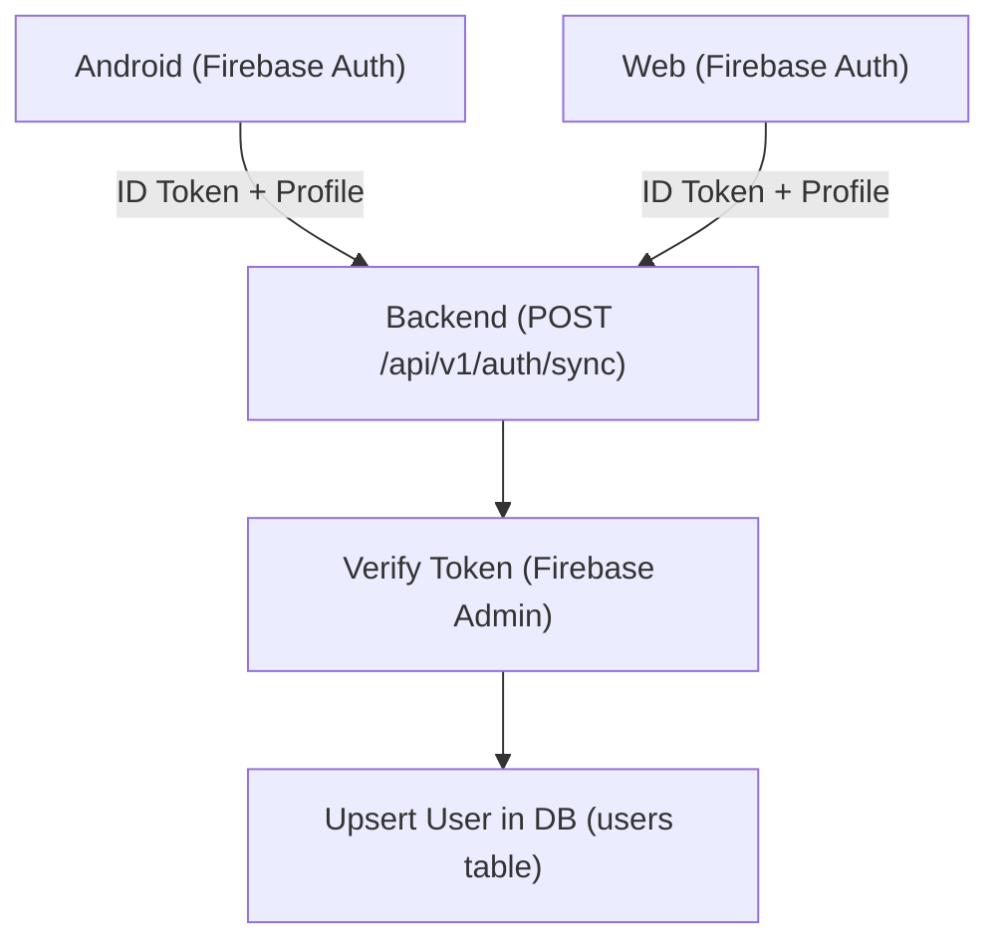

# User Sync & Firestore Removal — Walkthrough

## สิ่งที่ทำ

ทำการติดตั้ง API Endpoint ใหม่ `/api/v1/auth/sync` บน Backend (Go) เพื่อรับสมัครโปรไฟล์ User ไปเก็บลงตาราง Postgres (`users`)

ทำการ Refactor ฝั่ง Frontend (Android, Web) เพื่อ **ลบ** การเรียกใช้งาน `FirebaseFirestore` และย้าย Logic ไปยืนยันตัวตนกับ Backend API แทน

## Architecture ใหม่ (Data Flow)

## ไฟล์ที่แก้ไขหลัก

| Platform | File | การเปลี่ยนแปลง |
|----------|------|----------------|
| Backend | `userhub.go` | **[NEW]** สร้าง Models และ Table migration สำหรับ `User` |
| Backend | `auth_handler.go` | **[NEW]** สร้าง `SyncUser` handler เพื่อรับ payload การ login |
| Web | `auth.service.ts` | ลบ Firestore. `createUserDocument` ถูกเปลี่ยนไปใช้ HTTP fetch สู่ `SyncUser` |
| Web | `firebase.ts` | เลิกลงทะเบียนเชื่อมต่อ `getFirestore(app)` |
| Android | `AuthRepositoryImpl.kt` | Refactor เพื่อเรียกใช้ API ผ่าน Retrofit (`AuthApi.syncUser`) |
| Android | `NetworkModule.kt` | เพิ่ม `AuthApi` provider ลงใน Hilt พร้อมกับเบรก Dependency Cycle ระหว่าง Interceptor กับ Repository |
| Android | `build.gradle.kts` | ลบ `firebase-firestore` dependency ทิ้ง |

## ผลการทดสอบ

| Test | ผลลัพธ์ |
|------|---------|
| Web Login Google ยิง API ไป Backend | ✅ สำเร็จ (200 OK — `User synced successfully`) |
| Android Compile DI Tree ใหม่ | ✅ สำเร็จ (`BUILD SUCCESSFUL`) ไร้ Dagger Dependency Cycles |
| ลบ `FirestoreWisdomGardenRepository.kt` | ✅ ลบอย่างปลอดภัย ไม่มี error จาก KSP หลงเหลือ |
| Web ESLint | ✅ ไม่แจ้ง Error ขาดตัวแปร |
| Run All Pre-commit hooks | ✅ `Everything passed!` |

## ข้อดีของการลบ Firestore
- **Single Source of Truth**: Backend มีสิทธิ์เด็ดขาดในการคุม Profile ของ User ทำให้การทำ Relationships ระหว่าง User และ Practice ภายหลังง่ายขึ้น
- **App Size ย่อขนาด**: Android ไม่ต้องโหลด SDK Firestore ลดขนาดไฟล์ APK
- **Security Control**: Backend จะ Reject ทุก Token ปลอมโดยตรงจาก Endpoint ทำให้ Logic ไม่กระจายไปตกอยู่บน Firestore Security Rules
