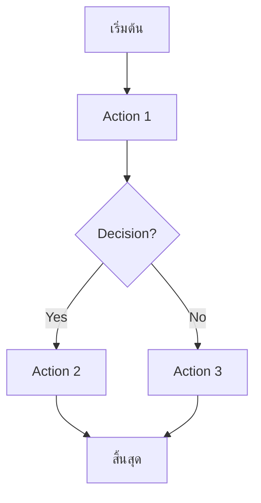

# Analysis Template

> 📋 Template สำหรับการวิเคราะห์ก่อนเริ่มพัฒนา Feature

---

## 📌 Feature Information

| รายการ | รายละเอียด |
|--------|-----------|
| **Feature Name** | [ชื่อ Feature] |
| **Issue URL** | [Link to GitHub Issue, e.g. [#123](https://github.com/owner/repo/issues/123)] |
| **Date** | [วันที่วิเคราะห์] |
| **Analyst** | Luma AI (Senior Technical Analyst) |
| **Priority** | 🔴 High / 🟡 Medium / 🟢 Low |
| **Status** | 📝 Draft / ✅ Approved / 🚀 In Progress |

---

## 1. Requirement Analysis

### 1.1 Problem Statement

> อธิบายปัญหาที่ต้องการแก้ไข

```
[ระบุปัญหาที่ผู้ใช้หรือธุรกิจกำลังเผชิญ]
```

### 1.2 User Stories

| # | As a | I want to | So that |
|---|------|-----------|---------|
| 1 | [Role] | [Action] | [Benefit] |
| 2 | [Role] | [Action] | [Benefit] |

### 1.3 Acceptance Criteria

- [ ] **AC1:** [Criteria 1]
- [ ] **AC2:** [Criteria 2]
- [ ] **AC3:** [Criteria 3]

---

## 2. Feature Analysis

### 2.1 User Flow



### 2.2 Screen/Page Requirements

| หน้าจอ | Actions | Components |
|--------|---------|------------|
| [Screen 1] | [Actions] | [Components] |
| [Screen 2] | [Actions] | [Components] |

### 2.3 Input/Output Specification

#### Inputs

| Field | Type | Required | Validation |
|-------|------|----------|------------|
| [field1] | string | ✅ | max 100 chars |
| [field2] | number | ❌ | min 0 |

#### Outputs

| Field | Type | Description |
|-------|------|-------------|
| [field1] | string | [description] |
| [field2] | boolean | [description] |

---

## 3. Impact Analysis

### 3.1 Affected Components

| Component | Impact Level | Description |
|-----------|--------------|-------------|
| [Component 1] | 🔴 High | [description] |
| [Component 2] | 🟡 Medium | [description] |
| [Component 3] | 🟢 Low | [description] |

### 3.2 Breaking Changes

- [ ] **BC1:** [Description of breaking change]
- [ ] **BC2:** [Description of breaking change]

### 3.3 Backward Compatibility Plan

```
[อธิบายแผนการรองรับ Backward Compatibility]
```

---

## 4. Feasibility Analysis

### 4.1 Technical Feasibility

| คำถาม | คำตอบ | หมายเหตุ |
|-------|-------|----------|
| เทคโนโลยีรองรับหรือไม่? | ✅ / ⚠️ / ❌ | [notes] |
| ทีมมี Skills เพียงพอหรือไม่? | ✅ / ⚠️ / ❌ | [notes] |
| Infrastructure รองรับหรือไม่? | ✅ / ⚠️ / ❌ | [notes] |

### 4.2 Time Feasibility

| ประเด็น | รายละเอียด |
|--------|-----------|
| **Estimated Effort** | [X] days/weeks |
| **Deadline** | [Date] |
| **Buffer Time** | [X] days |
| **Feasible?** | ✅ / ⚠️ / ❌ |

### 4.3 Budget Feasibility

| รายการ | ค่าใช้จ่าย | หมายเหตุ |
|--------|-----------|----------|
| [Item 1] | [Cost] | [notes] |
| [Item 2] | [Cost] | [notes] |
| **Total** | [Total Cost] | |

---

## 5. Security Analysis

### 5.1 Sensitive Data

| ข้อมูล | Sensitivity Level | Protection Method |
|--------|------------------|-------------------|
| [Data 1] | 🔴 Critical | Encryption + Access Control |
| [Data 2] | 🟡 Sensitive | Access Control |
| [Data 3] | 🟢 Normal | Standard |

### 5.2 Attack Vectors

| Vector | Risk Level | Mitigation |
|--------|-----------|------------|
| [Attack 1] | 🔴 High | [mitigation plan] |
| [Attack 2] | 🟡 Medium | [mitigation plan] |

### 5.3 Authentication & Authorization

```
[อธิบาย Auth Strategy]
```

---

## 6. Performance & Scalability Analysis

### 6.1 Performance Targets

| Metric | Target | Current |
|--------|--------|---------|
| Response Time | < 200ms | N/A |
| Throughput | 1000 req/s | N/A |
| Error Rate | < 0.1% | N/A |

### 6.2 Scalability Plan

| Scenario | Expected Users | Scaling Strategy |
|----------|---------------|------------------|
| Normal | [X] users | [strategy] |
| Peak | [X] users | [strategy] |
| Growth (1yr) | [X] users | [strategy] |

---

## 7. Gap Analysis

| ด้าน | As-Is (ปัจจุบัน) | To-Be (ต้องการ) | Gap |
|------|-----------------|-----------------|-----|
| [Aspect 1] | [current state] | [desired state] | [gap description] |
| [Aspect 2] | [current state] | [desired state] | [gap description] |

---

## 8. Risk Analysis

| Risk | Probability | Impact | Score | Mitigation Plan |
|------|-------------|--------|-------|-----------------|
| [Risk 1] | 🔴 High | 🔴 High | 9 | [plan] |
| [Risk 2] | 🟡 Medium | 🔴 High | 6 | [plan] |
| [Risk 3] | 🟢 Low | 🟡 Medium | 2 | [plan] |

> **Risk Score:** Probability × Impact (High=3, Medium=2, Low=1)

---

## 9. Summary & Recommendations

### 9.1 Analysis Summary

| หมวด | Status | Key Findings |
|------|--------|--------------|
| Requirement | ✅ Clear | [summary] |
| Feature | ✅ Defined | [summary] |
| Impact | ⚠️ Medium | [summary] |
| Feasibility | ✅ Feasible | [summary] |
| Security | ⚠️ Needs Review | [summary] |
| Performance | ✅ Acceptable | [summary] |
| Risk | ⚠️ Some Risks | [summary] |

### 9.2 Recommendations

1. **[Recommendation 1]**
2. **[Recommendation 2]**
3. **[Recommendation 3]**

### 9.3 Next Steps

- [ ] [Next step 1]
- [ ] [Next step 2]
- [ ] [Next step 3]

---

## 📎 Appendix

### Related Documents

- [Link to PRD]
- [Link to Design Docs]
- [Link to API Specs]

### Sign-off

| Role | Name | Date | Signature |
|------|------|------|-----------|
| Analyst | [Name] | [Date] | ✅ |
| Tech Lead | [Name] | [Date] | ⬜ |
| PM | [Name] | [Date] | ⬜ |
