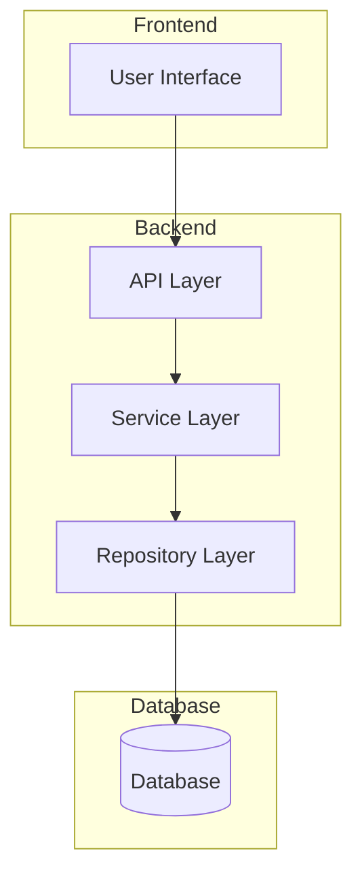
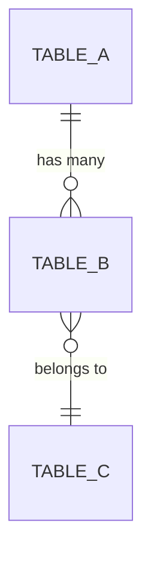
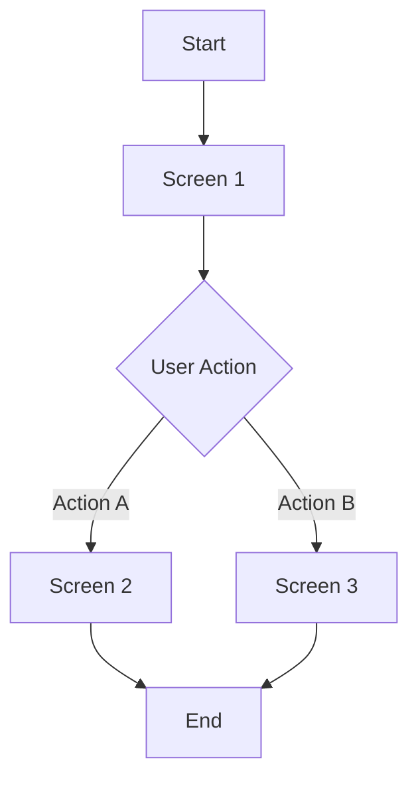
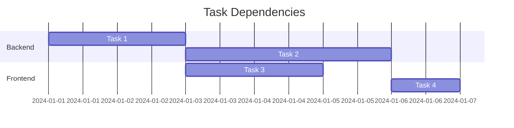

# Feature Specification Template

> 📋 Template สำหรับ Feature Specification Document

---

## 📌 Feature Overview

| รายการ | รายละเอียด |
|--------|-----------|
| **Feature Name** | [ชื่อ Feature] |
| **Version** | v1.0.0 |
| **Created Date** | [วันที่สร้าง] |
| **Last Updated** | [วันที่อัปเดตล่าสุด] |
| **Author** | [ชื่อผู้เขียน] |
| **Status** | 📝 Draft / 👀 In Review / ✅ Approved / 🚀 In Development |

---

## 1. Executive Summary

> สรุปภาพรวมของ Feature ใน 2-3 ประโยค

```
[สรุป Feature ว่าคืออะไร ทำไมต้องสร้าง และใครจากได้ประโยชน์]
```

### Scope & Phasing

> [!IMPORTANT]
> **Platform Scope Policy:**
> - **Android**: Full implementation with production-ready code and tests.
> - **Web**: Mock UI only for this phase (visual design and user flow demonstration).
>
> **Development Order:** Web Mock UI FIRST → Android Full Implementation SECOND.

*Adjust the above based on the specific feature requirements.*

---

## 2. Problem Statement

### 2.1 Current Pain Points

1. **[Pain Point 1]:** [Description]
2. **[Pain Point 2]:** [Description]
3. **[Pain Point 3]:** [Description]

### 2.2 Business Impact

| Metric | Before | Expected After | Improvement |
|--------|--------|----------------|-------------|
| [Metric 1] | [value] | [value] | [%] |
| [Metric 2] | [value] | [value] | [%] |

---

## 3. Goals & Success Criteria

### 3.1 Goals

| # | Goal | Measurable? |
|---|------|-------------|
| G1 | [Goal 1] | ✅ |
| G2 | [Goal 2] | ✅ |
| G3 | [Goal 3] | ✅ |

### 3.2 Success Criteria (KPIs)

| KPI | Target | Measurement Method |
|-----|--------|-------------------|
| [KPI 1] | [Target Value] | [How to measure] |
| [KPI 2] | [Target Value] | [How to measure] |

---

## 4. User Stories & Requirements

### 4.1 User Stories

#### Epic: [Epic Name]

##### Story 1: [Story Title]

```
As a [role]
I want to [action]
So that [benefit]
```

**Acceptance Criteria:**

- [ ] Given [context], When [action], Then [expected result]
- [ ] Given [context], When [action], Then [expected result]

##### Story 2: [Story Title]

```
As a [role]
I want to [action]
So that [benefit]
```

**Acceptance Criteria:**

- [ ] Given [context], When [action], Then [expected result]

### 4.2 Functional Requirements

| ID | Requirement | Priority | MoSCoW |
|----|-------------|----------|--------|
| FR-001 | [Requirement description] | 🔴 High | Must Have |
| FR-002 | [Requirement description] | 🟡 Medium | Should Have |
| FR-003 | [Requirement description] | 🟢 Low | Could Have |

### 4.3 Non-Functional Requirements

| ID | Category | Requirement |
|----|----------|-------------|
| NFR-001 | Performance | Response time < 200ms |
| NFR-002 | Scalability | Support 10,000 concurrent users |
| NFR-003 | Security | Data encrypted at rest and in transit |
| NFR-004 | Availability | 99.9% uptime |

---

## 5. Technical Design

### 5.1 System Architecture



### 5.2 Database Schema

#### Tables

##### Table: `[table_name]`

| Column | Type | Nullable | Default | Description |
|--------|------|----------|---------|-------------|
| id | UUID | No | auto-gen | Primary Key |
| [column2] | VARCHAR(255) | No | - | [description] |
| [column3] | INTEGER | Yes | 0 | [description] |
| created_at | TIMESTAMP | No | NOW() | Creation timestamp |
| updated_at | TIMESTAMP | No | NOW() | Last update timestamp |

#### Relationships



### 5.3 API Specification

#### Endpoint 1: `[HTTP_METHOD] /api/v1/[resource]`

**Description:** [What this endpoint does]

**Request:**

```json
{
  "field1": "string",
  "field2": 123,
  "field3": true
}
```

**Response (200 OK):**

```json
{
  "success": true,
  "data": {
    "id": "uuid",
    "field1": "value",
    "field2": 123
  }
}
```

**Error Responses:**

| Status Code | Error Code | Description |
|-------------|------------|-------------|
| 400 | INVALID_REQUEST | Request validation failed |
| 401 | UNAUTHORIZED | Authentication required |
| 404 | NOT_FOUND | Resource not found |
| 500 | INTERNAL_ERROR | Server error |

---

## 6. UI/UX Design

### 6.1 Wireframes

> แนบ Link หรือ Embed รูป Wireframes

| Screen | Link | Notes |
|--------|------|-------|
| [Screen 1] | [Figma/Link] | [notes] |
| [Screen 2] | [Figma/Link] | [notes] |

### 6.2 User Flow



### 6.3 Component List

| Component | Props | Events | Notes |
|-----------|-------|--------|-------|
| [Component1] | [props] | [events] | [notes] |
| [Component2] | [props] | [events] | [notes] |

---

## 7. Task Breakdown

### 7.1 Development Tasks

| # | Task | Type | Estimate | Assignee | Status |
|---|------|------|----------|----------|--------|
| 1 | [Task 1] | Backend | 2d | [Name] | ⬜ Not Started |
| 2 | [Task 2] | Frontend | 3d | [Name] | ⬜ Not Started |
| 3 | [Task 3] | Testing | 1d | [Name] | ⬜ Not Started |

### 7.2 Dependencies



### 7.3 Milestones

| Milestone | Target Date | Deliverables |
|-----------|-------------|--------------|
| M1: Design Complete | [Date] | Wireframes, API Spec |
| M2: Backend Complete | [Date] | APIs, Database |
| M3: Frontend Complete | [Date] | UI Implementation |
| M4: Testing Complete | [Date] | Test Cases, Bug Fixes |
| M5: Release | [Date] | Production Deployment |

---

## 8. Testing Strategy

### 8.1 Test Scope

| Test Type | Scope | Tool |
|-----------|-------|------|
| Unit Tests | Business Logic, Utilities | Jest/Vitest |
| Integration Tests | API Endpoints | Supertest |
| E2E Tests | User Flows | Playwright |
| Performance Tests | Load Testing | k6 |

### 8.2 Test Cases

| TC ID | Description | Expected Result | Priority |
|-------|-------------|-----------------|----------|
| TC-001 | [Test case description] | [Expected result] | 🔴 High |
| TC-002 | [Test case description] | [Expected result] | 🟡 Medium |

---

## 9. Definition of Done (DoD)

- [ ] ✅ All Acceptance Criteria met
- [ ] 🧪 Unit Test Coverage ≥ 80%
- [ ] 🧪 Integration Tests passed
- [ ] 🧪 E2E Tests passed (critical paths)
- [ ] 📝 API Documentation updated
- [ ] 📝 User Documentation updated
- [ ] 👀 Code Review approved
- [ ] 🔒 Security Review passed
- [ ] ⚡ Performance Tests passed
- [ ] 🚀 Successfully deployed to Staging
- [ ] ✅ QA Sign-off

---

## 10. Rollout Plan

### 10.1 Release Strategy

| Phase | Scope | Date | Rollback Plan |
|-------|-------|------|---------------|
| Alpha | Internal Team | [Date] | [Rollback plan] |
| Beta | 10% Users | [Date] | [Rollback plan] |
| GA | 100% Users | [Date] | [Rollback plan] |

### 10.2 Feature Flags

| Flag Name | Description | Default |
|-----------|-------------|---------|
| [flag_name] | [description] | false |

---

## 11. Appendix

### 11.1 Glossary

| Term | Definition |
|------|------------|
| [Term 1] | [Definition] |
| [Term 2] | [Definition] |

### 11.2 References

- [Reference 1]
- [Reference 2]

### 11.3 Change Log

| Version | Date | Author | Changes |
|---------|------|--------|---------|
| v1.0.0 | [Date] | [Author] | Initial draft |

---

## Sign-off

| Role | Name | Date | Status |
|------|------|------|--------|
| Product Owner | [Name] | [Date] | ⬜ Pending |
| Tech Lead | [Name] | [Date] | ⬜ Pending |
| QA Lead | [Name] | [Date] | ⬜ Pending |
| UX Designer | [Name] | [Date] | ⬜ Pending |
